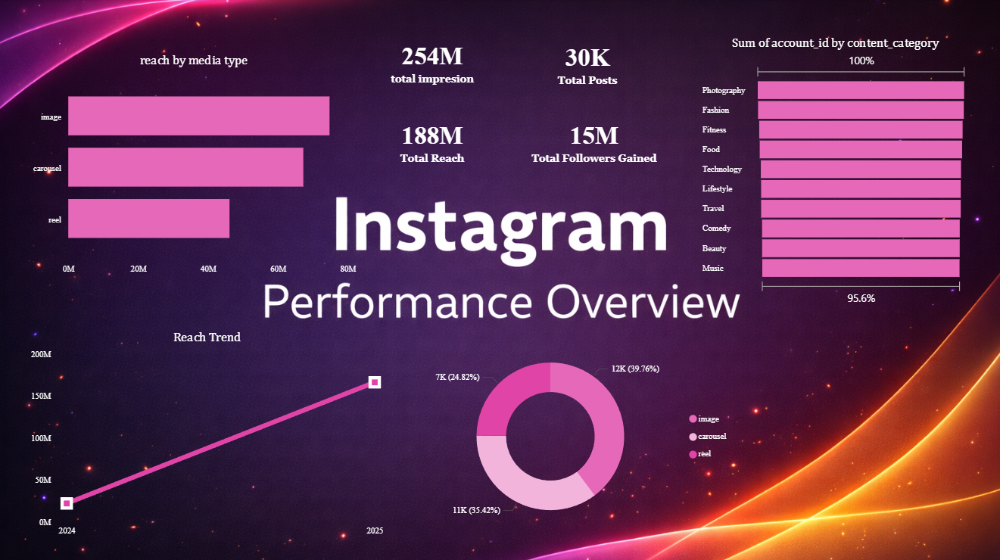
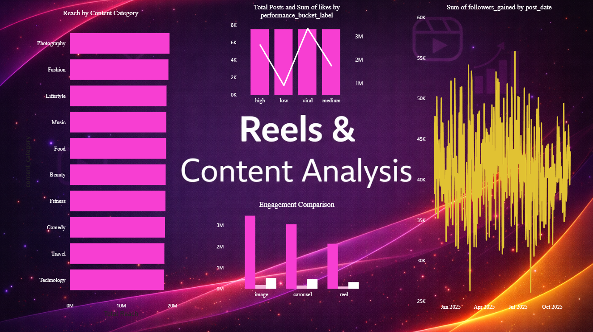

# 📊 Instagram Performance Analytics Dashboard (Power BI)

This project showcases a **FAANG-level Power BI dashboard** built to analyze **Instagram performance, content effectiveness, engagement trends, and growth strategy** using real-world analytics data.

---

## 🚀 Project Objective

To help creators, marketers, and businesses answer key questions:
- How is the Instagram account performing overall?
- What type of content drives the highest reach and engagement?
- When is the best time to post for maximum follower growth?

---

## 📸 Dashboard Preview

### 🔹 Instagram Performance Overview

---

### 🔹 Reels & Content Analysis

---

### 🔹 Best Time & Growth

## 🛠 Tools & Technologies
- Power BI
- DAX (Measures & KPIs)
- Data Modeling
- Data Visualization
- Business Analytics

---

## 📁 Dataset Overview
The dataset contains post-level Instagram analytics data including:
- Reach & Impressions  
- Likes, Shares, Saves  
- Media Type (Image, Carousel, Reel)  
- Content Category  
- Post Date & Time  
- Followers Gained  
- Performance Bucket (Low, Medium, High, Viral)

---

## 📊 Dashboard Pages

### 1️⃣ Instagram Performance Overview
- Total Reach, Impressions, Posts, Followers Gained
- Reach trend over time
- Media type reach comparison
- Content category distribution

**Insight:**  
Reels and images drive significant reach with consistent growth patterns.

---

### 2️⃣ Reels & Content Analysis
- Reach by content category
- Engagement comparison (likes, shares, saves)
- Performance bucket analysis
- Followers gained trend

**Insight:**  
High-performing and viral posts generate disproportionate engagement.

---

### 3️⃣ Best Time & Growth
- Posting time vs reach analysis
- Follower growth over time
- Identification of optimal posting windows

**Insight:**  
Posting during peak hours with strong content leads to higher follower growth.

---

## 🎨 Design Approach
- FAANG-style minimal dashboard design
- Instagram-inspired color palette
- Insight-driven titles
- Clear visual hierarchy and whitespace
- Focus on decision-making, not just visuals

---

## 📂 Project Files
- `INSTAGRAM ANALYSIS DASHBOARD 2024 TO 2025.pbix`
- Dashboard preview images
- Dataset (CSV)

---

## 📌 Key Learnings
- Business-focused data storytelling
- KPI-driven dashboard design
- Advanced Power BI visualization
- Real-world analytics problem solving

---

## 👤 Author
**Abrar Ahmed**  
Aspiring Data Analyst | Power BI | Data Visualization

---
instagram-performance-analytics-powerbi/
│
├── data/
│   └── Instagram_Analytics.csv
│
├── dashboard/
│   └── INSTAGRAM ANALYSIS DASHBOARD 2024 TO 2025.pbix
│
├── images/
│   ├── dashboard_page1.png
│   ├── dashboard_page2.png
│   └── dashboard_page3.png
│
└── README.md

⭐ If you find this project useful, feel free to star the repository!
